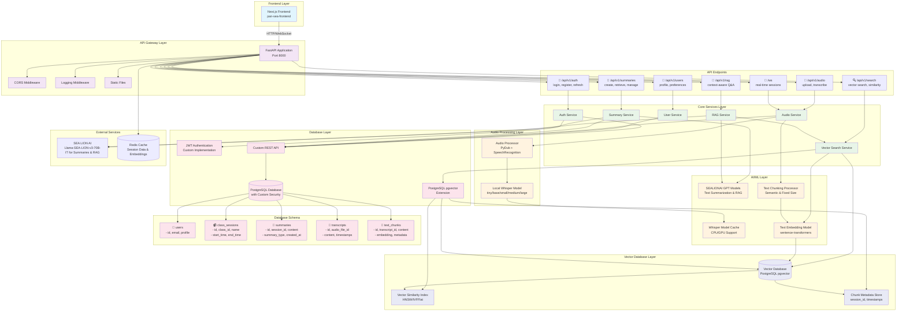

# Pan-Sea Backend Architecture

## Architecture Diagram

```mermaid
flowchart TB
 subgraph subGraph0["Frontend Layer"]
        FE["Next.js Frontend<br>pan-sea-frontend"]
  end
 subgraph subGraph1["API Gateway Layer"]
        FASTAPI["FastAPI Application<br>Port 8000"]
        CORS["CORS Middleware"]
        LOG["Logging Middleware"]
        STATIC["Static Files"]
  end
 subgraph subGraph2["Core Services Layer"]
        AUTH_SVC["Auth Service"]
        AUDIO_SVC["Audio Service"]
        SUM_SVC["Summary Service"]
        USER_SVC["User Service"]
        SEARCH_SVC["Vector Search Service"]
        RAG_SVC["RAG Service"]
  end
 subgraph subGraph3["Audio Processing Layer"]
        WHISPER["Local Whisper Model<br>tiny/base/small/medium/large"]
        AUDIO_PROC["Audio Processor<br>PyDub + SpeechRecognition"]
  end
 subgraph subGraph4["AI/ML Layer"]
        LLM["SEALIONAI GPT Models<br>Text Summarization & RAG"]
        WHISPER_MODEL["Whisper Model Cache<br>CPU/GPU Support"]
        EMBEDDING_MODEL["Text Embedding Model<br>sentence-transformers"]
        CHUNK_PROC["Text Chunking Processor<br>Semantic & Fixed Size"]
  end
 subgraph subGraph5["Vector Database Layer"]
        VECTOR_DB[("Vector Database<br>PostgreSQL pgvector")]
        VECTOR_INDEX["Vector Similarity Index<br>HNSW/IVFFlat"]
        METADATA_STORE["Chunk Metadata Store<br>session_id, timestamps"]
  end
 subgraph subGraph6["Database Layer"]
    AUTH_SYSTEM["JWT Authentication<br>Custom Implementation"]
    POSTGRES_DB[("PostgreSQL Database<br>with Custom Security")]
    REST_API["Custom REST API"]
    VECTOR_EXT["PostgreSQL pgvector<br>Extension"]
  end
 subgraph subGraph7["Database Schema"]
        USERS["👥 users<br>- id, email, profile"]
        SESSIONS["📹 class_sessions<br>- id, class_id, name<br>- start_time, end_time"]
        SUMMARIES["📝 summaries<br>- id, session_id, content<br>- summary_type, created_at"]
        TRANSCRIPTS["📄 transcripts<br>- id, audio_file_id<br>- content, timestamps"]
        CHUNKS["🧩 text_chunks<br>- id, transcript_id, content<br>- embedding, metadata"]
  end
 subgraph subGraph8["API Endpoints"]
        AUTH_EP["🔐 /api/v1/auth<br>login, register, refresh"]
        USER_EP["👤 /api/v1/users<br>profile, preferences"]
        AUDIO_EP["🎵 /api/v1/audio<br>upload, transcribe"]
        SUM_EP["📝 /api/v1/summaries<br>create, retrieve, manage"]
        SEARCH_EP["🔍 /api/v1/search<br>vector search, similarity"]
        RAG_EP["🤖 /api/v1/rag<br>context-aware Q&A"]
        WS_EP["🔄 /ws<br>real-time sessions"]
  end
 subgraph subGraph9["External Services"]
        SEALIONAI["SEA LION AI<br>Llama-SEA-LION-v3-70B-IT for Summaries & RAG"]
        REDIS[("Redis Cache<br>Session Data & Embeddings")]
  end

    %% Main Flow Connections
    FE -- HTTP/WebSocket --> FASTAPI
    FASTAPI --> CORS & LOG & STATIC & AUTH_EP & USER_EP & AUDIO_EP & SUM_EP & SEARCH_EP & RAG_EP & WS_EP & REDIS
    
    %% Service Connections
    AUTH_EP --> AUTH_SVC
    USER_EP --> USER_SVC
    AUDIO_EP --> AUDIO_SVC
    SUM_EP --> SUM_SVC
    SEARCH_EP --> SEARCH_SVC
    RAG_EP --> RAG_SVC
    WS_EP --> AUDIO_SVC
    
    %% Core Service to Infrastructure
    AUTH_SVC --> AUTH_SYSTEM & REST_API
    USER_SVC --> REST_API
    AUDIO_SVC --> AUDIO_PROC & REST_API
    SUM_SVC --> LLM & REST_API & SEALIONAI
    
    %% Vector Search & RAG Flow
    SEARCH_SVC --> EMBEDDING_MODEL & VECTOR_DB & VECTOR_EXT
    RAG_SVC --> SEARCH_SVC & LLM & SEALIONAI
    
    %% Audio Processing Flow
    AUDIO_PROC --> WHISPER
    WHISPER --> WHISPER_MODEL
    
    %% Text Processing & Embedding Flow
    AUDIO_SVC --> CHUNK_PROC
    CHUNK_PROC --> EMBEDDING_MODEL
    EMBEDDING_MODEL --> VECTOR_DB
    
    %% Database Connections
    REST_API --> POSTGRES_DB
    VECTOR_EXT --> VECTOR_DB & VECTOR_INDEX & METADATA_STORE
    POSTGRES_DB --> USERS & SESSIONS & SUMMARIES & TRANSCRIPTS & CHUNKS
    
    %% Vector Database Internal
    VECTOR_DB --> VECTOR_INDEX & METADATA_STORE

    %% Styling
     FE:::frontend
     FASTAPI:::api
     CORS:::api
     LOG:::api
     STATIC:::api
     AUTH_SVC:::service
     AUDIO_SVC:::service
     SUM_SVC:::service
     USER_SVC:::service
     SEARCH_SVC:::service
     RAG_SVC:::service
     WHISPER:::processing
     AUDIO_PROC:::processing
     LLM:::processing
     WHISPER_MODEL:::processing
     EMBEDDING_MODEL:::processing
     CHUNK_PROC:::processing
     VECTOR_DB:::vector
     VECTOR_INDEX:::vector
     METADATA_STORE:::vector
     AUTH_SYSTEM:::database
     POSTGRES_DB:::database
     REST_API:::database
     VECTOR_EXT:::database
     USERS:::database
     SESSIONS:::database
     SUMMARIES:::database
     TRANSCRIPTS:::database
     CHUNKS:::database
     SEALIONAI:::extern
     REDIS:::extern
     
    classDef frontend fill:#e1f5fe
    classDef api fill:#f3e5f5
    classDef service fill:#e8f5e8
    classDef processing fill:#fff3e0
    classDef database fill:#fce4ec
    classDef vector fill:#e8eaf6
    classDef external fill:#f1f8e9
```